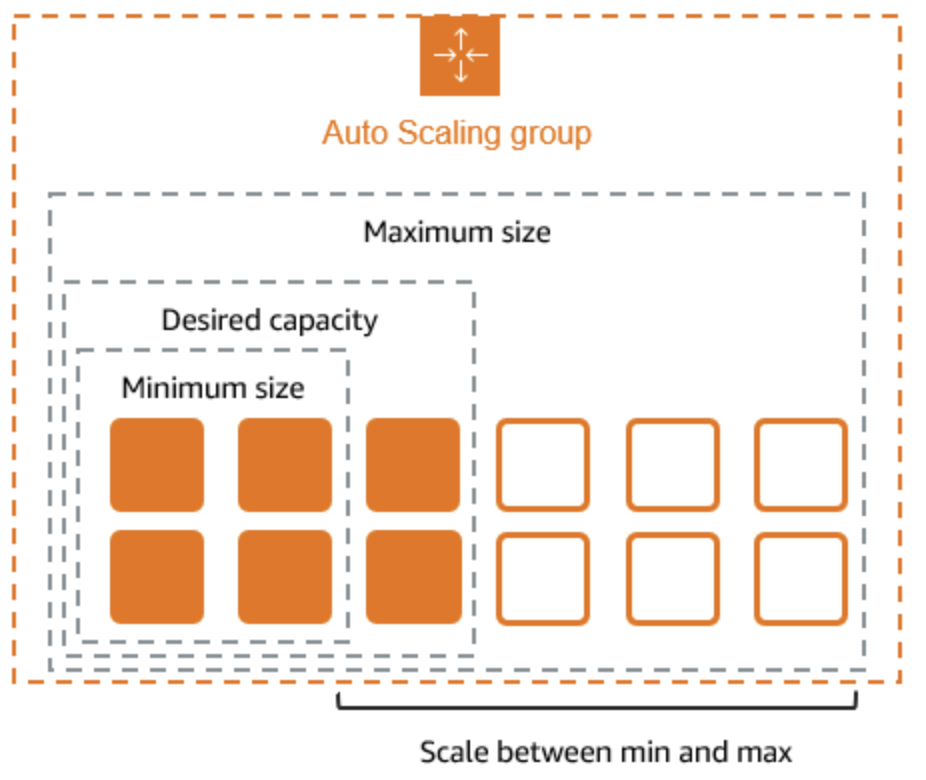
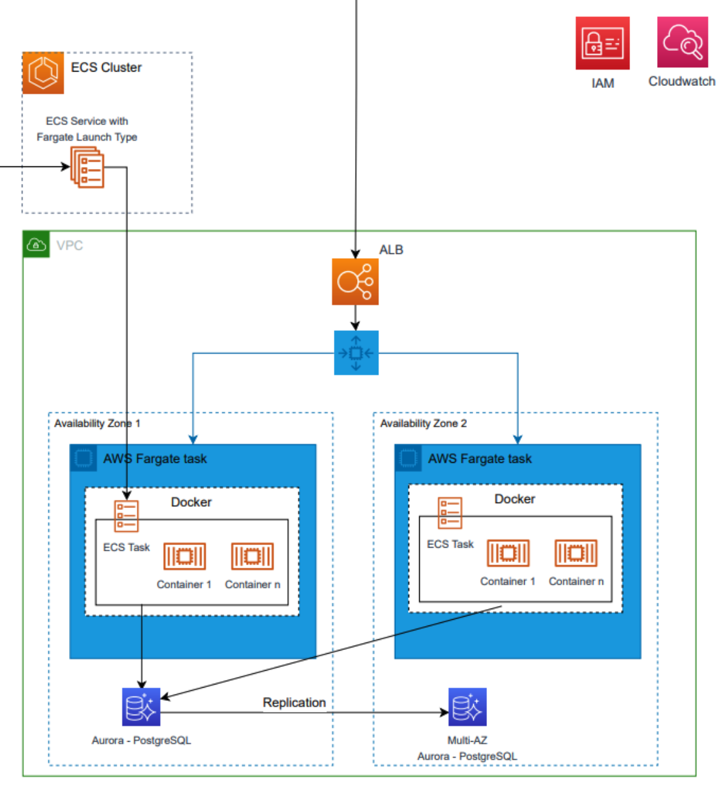
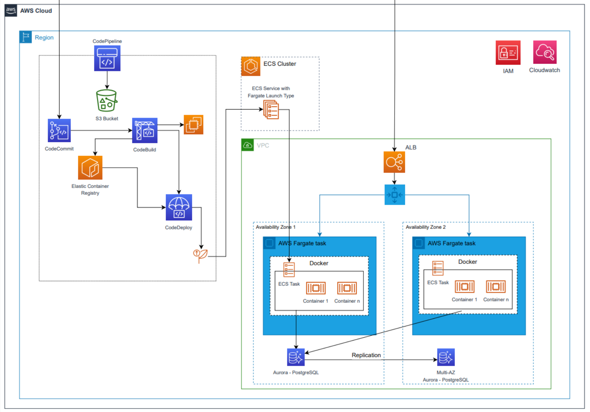

## AWS

### 1. AWS 활용을 위한 사전세팅

#### 1.1 Route53 도메인 설정과 AWS Certificate Manager

> `Route53`에서 도메인 구입 후 `ACM` 에서 인증서 설정

> `Route 53` - AWS 에서 지원하는 DNS 웹 서비스
>
> > - 주요기능
> >   > - 도메인 이름 구입/등록
> >   >
> >   >   > - 끝에 `link`로 끝나면 제일 저렴하다고 한다.
> >   >   > - AWS에서 도메인 구입시, CloudFront, API Gateway, Elastic Load Balancer 처럼 AWS에서 구입한 도메인과 인증서를 사용할 때 연동이 굉장히 편리해짐.
> >   >   >   > - CNAME 레코드 생성:
> >   >   >   >   > - ACM은 도메인 소유권을 확인하기 위해 추가해야 하는 CNAME 레코드 정보를 제공
> >   >   >   >   > - 해당 CNAME 레코드를 AWS Route 53에서 관리하는 도메인의 호스팅 영역에 추가
> >   >   >   > - 각기 다른 서브도메인에 대해 여러 개의 `CNAME` 레코드를 추가하는 것은 가능하며, 이를 통해 다양한 서비스나 인증 설정을 관리할 수 있다. `Route 53`에서 이러한 설정을 관리할 때는 각 레코드의 이름과 값을 정확히 입력하는 것이 중요(<mark>이 부분에서 편하다는</mark>)
> >   >   >   > - 하나의 도메인 아래에서 여러 서비스나 웹사이트 섹션을 관리할 수 있다. `서브도메인`을 사용하면 각기 다른 서버나 애플리케이션으로 트래픽을 분산시킬 수 있어 유연한 웹사이트 운영이 가능
> >   >   > - 가비아, GoDaddy 같은 데서 도메인을 구매한 경우, AWS의 Transfer domain에서 변환해줘야함. 근데 도메인을 구입한 곳에서 다른데로(AWS) 도메인을 전환할 수 있도록 `도메인 잠금`, `도메인 정보 보호` 등을 풀어놔야 함
> >   >
> >   > - 트래픽 라우팅

> `AWS Certificate Manager(ACM)` - `AWS` 서비스에서 사용할 수 있는 `SSL/TLS` 인증서
>
> > - `ACM`에서 발급하는 인증서 자체에는 별도의 비용이 발생하지 않음
>
> > - `Route53`에서 도메인을 연결해야 사용 가능
> >   > - `Elastic Load Balancer`에서도 `DNS`를 제공하지만, `Route53`에서 `routing`해야 `ACM` 인증서를 사용할 수 있음
> > - `Route53`의 도메인을 활용해야 `ACM`의 인증서를 사용할 수 있음
>
> - ACM 사용사례
>   > - `CloudFront`는 `CDN`(콘텐츠 전송 네트워크)서비스로, 전 세계에 분산된 엣지 로케이션을 통해 콘텐츠를 빠르게 전달한다. 주로 S3와 많이 사용됨. S3는 스토리지라서 사진, 영상같은 것을 저장하거나 아니면 fe에선 빌드된 파일을 저장해놓고 S3 스토리지 자체는 프라이빗을 둔 다음에 `CloudFront`와 S3를 연결해서 `CloudFront`통해서 접근하게 한다. 그럴 경우 도메인을 연결하는게 필요하기 때문에 `CloudFront`가 존재
>   >   > 1. 프론트엔드 빌드 파일을 S3에 저장
>   >   >    > - 정적 파일
>   >   > 2. S3 버킷을 프라이빗으로 설정
>   >   >    > - URL을 통해 직접 접근 X
>   >   > 3. CloudFront와 S3 연결
>   >   >    > - CloudFront는 AWS의 CDN 서비스로, S3 버킷을 오리진으로 설정하여 콘텐츠를 전 세계 엣지 로케이션을 통해 빠르게 제공할 수 있다. CloudFront를 사용하면 S3의 정적 파일에 대한 요청이 엣지 서버를 통해 전달
>   >   > 4. ACM을 통한 SSL/TLS 인증서 사용
>   >   >    > - CloudFront 배포에 ACM을 통해 발급받은 SSL/TLS 인증서를 적용하면, 사용자와 CloudFront 간의 통신이 HTTPS로 암호화
>   > - ELB의 메인역할은 로드벨런싱(`트래픽을 여러 EC2 인스턴스에 분산시키는 역할을 하며, 고가용성과 확장성을 제공`). 근데 배포할 때 쓰는 ECS라든가 EC2에 도메인을 바로 붙일수가 없어서(물론 EC2에 Nginx를 써서 Certbot해서 LetsEncrypt로 인증서를 붙일 수 있는데(도메인과) AWS를 쓰니깐 앞에 ELB를 붙여서 ELB에 도메인을 붙인 다음에 EC2랑 연계하는게 조금 더 일반적) ELB에 도메인을 붙일 때 사용.
>   >   > - `ELB`에 도메인을 연결할 때, `HTTPS`를 통해 안전한 연결을 제공하기 위해 `SSL/TLS` 인증서를 사용. `ACM`을 통해 `ELB`에 인증서를 손쉽게 적용할 수 있다. 이렇게 하면 외부 트래픽이 `ELB`를 통해 `EC2` 인스턴스로 전달될 때 보안이 강화
>   >   > - 고가용성: 시스템이나 서비스가 가능한 한 오랜 시간 동안 지속적으로 운영될 수 있는 능력
>   >   >   > - `중복성(Redundancy)`: 여러 서버나 데이터 센터를 사용하여 한 시스템이 고장 나더라도 다른 시스템이 이를 대체할 수 있도록 한다.
>   >   >   > - `로드 밸런싱(Load Balancing)`: 트래픽을 여러 서버에 분산시켜 과부하를 방지하고, 시스템의 성능을 최적화. AWS의 ELB(Elastic Load Balancer)가 이러한 역할을 수행.
>   >   >   > - `장애 조치(Failover)`: 시스템의 일부가 실패할 경우 자동으로 다른 시스템으로 전환하여 서비스 중단을 방지.
>   >   >   > - `모니터링 및 알림`: 시스템 상태를 지속적으로 모니터링하여, 문제가 발생하면 신속하게 대응할 수 있도록 한다.
>   > - `API Gateway`는 API를 생성, 배포 및 관리할 수 있는 서비스로, `AWS Lambda`와 자주 사용. Lambda는 서버리스 컴퓨팅 서비스로, 코드를 실행하는 데 서버를 관리할 필요가 없다.
>   >   > - `API Gateway`를 통해 제공되는 API에 `HTTPS`를 적용하려면 `SSL/TLS` 인증서가 필요하다. `ACM`을 사용하여 `API Gateway`에 인증서를 쉽게 연결하여, API 호출 시 보안을 강화할 수 있다.
>   >   > - TLS/SSL
>   >   >   > - `SSL(Secure Sockets Layer)`와 `TLS(Transport Layer Security)`는 인터넷 상에서 안전한 통신을 제공하기 위한 암호화 프로토콜이다. TLS는 SSL의 후속 버전으로, SSL의 여러 취약점을 개선한 더 안전한 프로토콜. 현재는 TLS가 SSL을 대체하고 있으며, 대부분의 현대적인 시스템에서는 TLS를 사용
> - ACM 자체에서는 과금 X

#### 1.2 AWS Certificate Manager에서 인증서 생성 시 주의사항

> 구입한 도메인 이름 앞에 \* 을 붙여줘야 다양한 도메인에서 활용 가능
>
> - [www.juyongjun.link](http://www.juyongjun.link) 와 같은 도메인으로 발급하면 test.juyongjun.link 라는 도메인에서는 사용할 수 없음
>
> - 도메인 별로 인증서를 관리하고 싶다면, `subdomain`마다 따로 발급 받아도 됨
>
> - ACM에서 인증서를 관리한다면 추가 인증서는 비용이 발생하지 않음

#### 1.3 VPC 설정과 Subnet ↔️ Routing Table ↔️ Internet Gateway

> VPC - Virtual Private Cloud

> - 단어 뜻을 그대로 보자면 가상의 개인 클라우드
>
> > - AWS개념으로 보자면 하나의 `Region`에 여러 `Availability Zone(AZ)`이 있고, 각각의 `Availability Zone(AZ)`에 데이터센터가 존재함
> >   > - AWS에서는 사용자가 요청하는 EC2 인스턴스가 물리적으로 어디에 위치할지에 대해 직접적인 제어가 없다. 즉, 여러 개의 EC2 인스턴스를 생성하더라도 그것들이 같은 물리적 서버랙에 위치할 것이라는 보장이 없다. 이는 클라우드의 특성상 리소스가 가상화되어 여러 데이터센터에 분산되어 있기 때문이다.
> > - 일반적으로 데이터센터는 여러개의 서버랙이 있고, 각각의 서버랙에 여러대의 서버가 있다
> >   > - 전통적인 데이터센터에서는 여러 개의 서버랙이 있으며, 각 랙에는 여러 대의 서버가 물리적으로 배치되어 있다. 이러한 서버들은 물리적으로 가까이 위치해 있기 때문에 네트워크 통신이 빠르고 효율적이다.
> > - 하지만 여러개의 EC2를 사용한다고 했을 때, 같은 서버랙에 있는 서버를 발급받는다는 보장이 없음
> > - 각각 다른 서버랙에서 서버를 배정 받았을 때, VPC로 묶어서 마치 하나의 서버랙에서 서버를 관리하는 것처럼 하는 것이 VPC의 역할
> >   > - VPC는 이러한 환경에서 `가상 네트워크`를 제공함으로써, `물리적으로 분산된 EC2 인스턴스들을 하나의 네트워크로 묶어준다.` 이는 마치 물리적으로 `같은 서버랙에 있는 것처럼 네트워크를 구성할 수 있게 해 준다`. `VPC` 내에서 `서브넷`을 설정하고, 보안 그룹을 통해 네트워크 트래픽을 관리함으로써, 사용자는 이러한 가상 네트워크 환경을 자신이 원하는 대로 커스터마이즈할 수 있다.
> >   > - VPC는 `물리적으로 분산된 클라우드 리소스들을 논리적으로 하나의 네트워크로 묶어주는 역할`을 하며, 사용자가 원하는 네트워크 환경을 가상으로 구현할 수 있게 해준다.

> Subnet
>
> > - AWS에서 EC2와 같은 리소스들은 subnet을 할당함
>
> > - Subnet에는 `Public Subnet`과 `Private Subnet`이 있음
> >   > - `Public Subnet`은 `Public IP`와 유사한 느낌으로 `외부와 통신이 가능`
> >   > - `Private Subnet`은 반대로 외부와 통신이 불가능함
> >   >   > - 따라서 `Public IP`를 assign한다고 해도 어차피 외부와 통신이 불가능하기 때문에 낭비
> >   > - backend server나 database와 같이 클라이언트가 직접 접근할 필요가 없는 리소스들을 private subnet에 두고, 클라이언트가 직접 접근하는 프론트엔드 리소스는 public subnet에 배정

> Routing Table
>
> - 요청이 들어오면 어떤 subnet으로 보낼 지 정해둔 규칙

> Internet Gateway
>
> > - Public subnet은 routing table을 통해 Internet Gateway와 연결됨
>
> > - Internet Gateway를 통해서 외부와 통신이 가능함

### Elastic Compute Cloud (EC2)로 서비스 배포

#### EC2 인스턴스 생성과 Nginx 설치

> `Amazon EC2(Amazon Elastic Compute Cloud)`
>
> - `Amazon Web Services(AWS)`에서 제공하는 웹 서비스로, 사용자가 클라우드 환경에서 가상 서버를 쉽게 생성하고 관리할 수 있도록 지원

> `EC2` 특징
>
> - 유연한 컴퓨팅 용량: 사용자는 필요에 따라 인스턴스를 시작하거나 중지할 수 있으며, 트래픽 변화에 따라 컴퓨팅 자원을 쉽게 조정할 수 있다.
>
> - 다양한 인스턴스 유형: EC2는 다양한 인스턴스 유형을 제공하여 CPU, 메모리, 스토리지 및 네트워크 성능에 따라 최적화된 인스턴스를 선택할 수 있다.
>
> - 확장성 및 자동화: `Auto Scaling` 및 `Elastic Load Balancing`과 같은 기능을 통해 애플리케이션의 확장성을 자동화할 수 있다.
>
> - 보안 및 네트워킹: `VPC(Virtual Private Cloud)`를 통해 `네트워크 설정을 제어`하고, `보안 그룹 및 네트워크 ACL`을 사용하여 인스턴스에 대한 접근을 관리할 수 있다.
>
> - 비용 효율성: 사용한 만큼만 비용을 지불하는 요금제를 통해 비용 효율적으로 인프라를 운영할 수 있다.
>
> - 다양한 운영 체제 지원: `Windows, Linux` 등 다양한 운영 체제를 지원하여 사용자가 원하는 환경을 선택할 수 있다.

> `Nginx` - `Reverse Proxy Server`
>
> > - 외부에서 서버로 들어오는 요청을 redirect 해주는 역할
> > - 80, 443, 8000 등 포트로 요청이 들어오면, 서버 내 특정 리소스로 요청을 전달
> > - `EC2`에서는 `iptables`와 같은 툴을 사용해도 되지만 `nginx` 설정이 제일 편리하다고 생각함

:EC2를 만들고 Nginx로 연결한 다음 라우팅 되는 것까지 확인해보자

> - 이름은 주로 '프로젝트 이름'-'서비스 이름'
>   > - e.g. `this-is-project-ec2`, `this-is-project-lb`(load-balancing)
>   > - 서비스 이름 예시: Security Group(sg), Target Group(tg), Load Balancer(lb)
>   > - 생성한 인스턴스에 접근
> - `네트워크 설정`
>   > - 이전에 만들었던 vpc를 설정하고 public-subnet설정
>   > - 퍼블릭-ip 자동 할당 -> 활성화
>   > - 보안그룹 이름 설정
>   > - 보안그룹 규칙 추가해서 ssh(내 ip), http, https 추가
> - `Key pair(login)`
>   > - 퍼블릭 IP를 활용해서 서버에 접속해서 ssh로 접근가능하도록
>   > - 내 pc root(home)으로 `this-is-key.pem` 파일 이동
>   > - 만든 인스턴스에서 `connect` 선택 후 `SSH 클라이언트` 탭에서 `chmod 400 "this-is-key.pem"` 소유권 받기
>   > - ssh 연결, `ssh -i "this-is-key.pem" ec2-user@ec2-98-80-74-98.compute-1.amazonaws.com`
> - Nginx 설치
>   > - `sudo yum update -y && sudo yum install nginx -y`
>   > - enable 설정
>   >   > - `sudo systemctl enable nginx`
>   > - 시작
>   >   > - `sudo systemctl start nginx`
>   > - 상태 확인
>   >   > - `sudo systemctl status nginx`
> - 인스턴스의 퍼블릭 IPv4 주소를 통해 페이지 확인 가능(Nginx 설정된)

#### EC2 단독으로 SSL 인증서를 활용하는 방법과 Elastic IP

> `Not Secure`를 확인할 수 있는데, 클라이언트를 https로 ssl 인증서를 사용해 배포하면 클라이언트에서 http 사용 불가
>
> - client 사이드를 인증서를 적용해 배포하면 서버도 마찬가지로 인증서를 통해 배포해야 서비스 운영이 가능

> - EC2에 SSL attach
>   > - SSL 인증서는 도메인을 붙여줘야 함
>   > - route53에서 샀던 도메인에서 레코드 이름, 유형을 선택하고 value란에 EC2 인스턴스의 퍼블릭 IPv4 주소를 설정
>   > - 이제 설정한 레코드 이름을 통해 이전에 public ip를 통해 요청했던 페이지를 확인할 수 있음
> - EC2 인스턴스에 도메인 연결을 했고 도메인에 인증서를 붙여보자
>   > - 다시 shell을 통해 EC2 터미널로 접속(ssh)
>   > - Certbot(무료로 인증서를 쓰게 해주는 도구)를 사용, `Let's Encrypt 인증서`로 불리기도.. `도메인 인증만 되면` 사용 가능
>   >
>   >   > - Certbot은 80포트와 443포트를 통해 해당 Public IP가 도메인과 연결되어있는지를 판단함
>   >   > - EC2는 stop → start 할 경우 Public IP가 변경되기 때문에 Elastic IP 를 활용함
>   >   > - Elastic IP는 비싸기 때문에 비용에 주의해야 함
>   >
>   > - certbot-nginx 패키지 설치
>   >   > - Certbot이 Nginx랑 아파치랑 패키지가 다름
>   >   > - `sudo yum update -y && sudo yum install certbot python3-certbot-nginx -y`
>   > - Certbot으로 인증서 만들기
>   >   > - `sudo certbot --nginx -d this-is.juyongjun.link`
>   >   > - 3개월짜리 인증서
>   > - 이 도메인이 내 거라는 게 확실해야 인증서를 발급해주는데 그 과정은, 해당 도메인에 80포트와 443포트의 요청을 날린다.
>   >   > - 이전에 만든 SG(Security Group)에서 해당 포트의 요청을 허용했었다
>   >   > - `sever_name`이 빠져있는데 `sudo vim /etc/nginx/nginx.conf`에서 server_name 수정 후 `sudo systemctl restart nginx` 후 다시 인증서 갱신 `sudo certbot --nginx -d this-is.juyongjun.link`
>   >   > - `server_name` 에러는 사라지고, `ssl_certificate, ssl_certificate_key` 추가된 후 80으로 요청이 들어오면 https로 redirect시키는 것을 확인 가능
>   >   >   > - 즉 <mark>누군가가 https 프로토콜을 쓰지 않고 http로 접근을 하면 Ngix에서 https로 요청을 돌림</mark>

```shell
ssl_certificate /etc/letsencrypt/live/this-is.juyongjun.link/fullchain.pem; # managed by Certbot
ssl_certificate_key /etc/letsencrypt/live/this-is.juyongjun.link/privkey.pem; # managed by Certbot
...
server {
if ($host = this-is.juyongjun.link) {
    return 301 https://$host$request_uri;
} # managed by Certbot


    listen       80;
    listen       [::]:80;
    server_name  this-is.juyongjun.link;
return 404; # managed by Certbot
```

> > > - 재시작 `sudo systemctl restart nginx` 후 점검 `sudo systemctl status nginx`
> >
> > - 새로고침하면 `Not Secure`가 사라진 것을 확인 가능, 도메인에 인증서가 붙고 Nginx가 redirect
> > - 인증서의 만료기간은 3개월, 자동갱신하는 방법, 인증서를 갱신하는 명령어
> >   > - `sudo certbot renew --dry-run`
> > - 이걸 크론 탭에 넣어서 자동화
> >   > - `sudo yum install cronie -y`
> >   > - `sudo systemctl enable crond`
> >   > - `sudo systemctl start crond`
> >   > - `sudo systemctl status crond`
> >   > - `crontab -e`
> >   > - `0 0 1 * * sudo certbot renew --dry-run`
> >   >   > - 매월 1일에 갱신
> > - EC2인스턴스를 껐다 키면 퍼블릭 ip가 갱신되는데 이를 방지하기 위해 EC2의 `Elastic IP(고정 ip)` 사용, 하나 만들고 할당하기
> >   > - 다시 기존 route53에서의 public IP에 Elastic IP 설정
> > - Nginx는 로컬에 있는 SSL 인증서 위치를 지정해야 443 통신이 가능함
> >   > - 따라서 ACM 인증서를 EC2로 옮길 수 없다면 Nginx를 통해서 ACM인증서를 사용할 수 없음
>
> - ACM 인증서와 Let's Encrypt 인증서를 사용할 수 있는데 이번엔 Let's Encrypt 인증서를 사용했고 다음에 ACM 인증서를 사용해보자

#### Elastic Load Balancer ↔️ EC2

> `ELB`를 활용하면, `Elastic IP`를 사용하지 않고 `HTTPS` 통신이 가능함
>
> - `ELB`에서 `Target Group`을 설정할 때 `EC2` 인스턴스 자체를 타겟팅 할 수 있음
> - `ELB`에서 443으로 요청을 받고 `EC2`에는 80으로 요청을 보내는
>
>   > - ec2 설정
>   >   > - vpc 설정
>   >   > - `sg(Security Group)`으로 rule 추가
>   >   > - 새로 만든 ec2에 nginx설치, public Ip를 통해 접근이 가능한 것을 확인 가능
>   > - elb 설정
>   >   > - `tg(Target Group)`설정, target type을 instance로 설정
>   >   > - tg를 80으로, ec2에 80포트로 요청을 보내기
>   >   > - 이제 tg를 lb에 엮어야 한다, lb는 3개가 있다.
>   >   >   > - gateway lb, network lb(tcp, udp layer 활용시), Application lb(http, https 통신 활용시)
>   >   >   > - https -> Internet facing, 기존 vpc, <mark>Mappings</mark> 여기서 Availability Zone이 3개고, Public도 3개. 여기서 우리가 target하는 subnet을 골라야한다. 그래서 3개중 우리의 ec2 서브넷과 동일한 subnet을 1개는 꼭 설정해줘야
>   >   >   > - sg도 기존의 것을 사용(80, 443의 <mark>인바운드</mark>(`외부에서 내부 네트워크로 들어오는 트래픽 허용`))
>   >   >   > - Listener 설정에서 https 확인 전에 http:80요청 먼저 확인(tg settings)
>   >   > - 설정한 sg, Network mappings(vpc, subnet), Listeners and routing(tg)까지 설정이 된 것을 확인 가능
>   >   > - lb 설정후, dns로 접근하면 응답 확인 가능(인증서를 안붙여서 Not Secure)
>   >   >   > - Listeners and routing에 Listener를 추가
>   >   >   > - protocol를 https로 tg(80 -> ec2) 설정 후, Default SSL/TLS server certificate에서 <mark>From ACM</mark> 설정
>   >   >   > - 기존에 만든 ec2에 접속해서 nginx 설정을 확인해보면, 80포트로 요청이 오면 301에서 https로 redirect해서 protocol을 맞춰주는데, 이 작업을 <mark>Alb</mark>(Application lb)에서도 진행해보자
>   >   >   > - 지금은 443이던 80이던 tg를 향하는데, 80포트에 접근하면 redirect url(443포트)하도록(host는 유지)
>   >   > - 도메인에 인증서가 붙는데, lb의 DNS name에는 해당이 안됨,
>   >   >   > - route53에서 이전에 Elast Ip를 할당했던 Ec2에 Record를 수정해주는데, A레코드로 두고 Alias를 줄 수 있다. EndPoint를 lb로 설정(<mark>Alias to Network Load Balancer</mark>) 후 이전에 설정헀던 lb를 세팅하면 인증서가 적용이 된다.
>
> - 따라서 `EC2`의 `Public IP`가 변하는 것에서 자유로워짐
>
> `Route53`에서 `ELB`로 요청을 `redirect`하면 `ACM`의 인증서 활용 가능
>
> 정리하자면, AWS Certificate Manager(ACM)에서 인증서를 받아왔고, 그 인증서를 쓰려면 AWS 서비스에 인증서를 붙여야 된다. 직접적으로 AWS에서는 인증서를 붙이는 방법을 제공하지 않기 떄문에 `Load Balancer`를 써야 된다.
>
> - Load Balancer를 활용해서 TG를 쓰는 장점은 EC2인스턴스는 껐다 키면 IP가 바뀌는데, tg를 확인해보면 IP로 target을 캐치하는게 아니라 <mark>Instance ID</mark>로 캐치하고 있다. lb가 타겟하는 EC2의 인스턴스를 껐다 키면 IPv4가 바뀌는데도 IP로 타겟하는게 아니라 Instance ID로 target하기에 정상 작동함. 유사 Elastic Ip와 동일한 기능 수행

#### Bastion을 활용한 EC2 instance 접근

> - EC2는 `private subnet`에 두고 ELB를 `public subnet`에 두는 것이 정석
>
>   > - 현재 EC2, LB는 `public subnet`에 존재
>   > - 현재 VPC안에 public subnet과 private subnet이 있고, public subnet에 ALB가 있고 EC2가 있음.
>   > - ALB가 요청을 받고 EC2로 접근을 하지만, 외부에서 ALB를 거치지 않고 바로 EC2로 접근이 가능.
>   >   > - 실제로 로컬에서 EC2로 접근한 다음에 nginx를 설정했었던 것처럼 -> <mark> 보안에 취약
>   >   > - Rotue table의 public으로 이어져 있는것이다. IG(인터넷 게이트웨이)를 통해서.
>   > - 그래서 보안을 강화하기 위해, <mark>EC2를 private subnet에 두어야 함</mark>
>   >   > - 그리고 외부에서 들어오는 요청을 ALB가 받을수있게 해주야 함.
>   >   > - 근데 이러면 EC2에 있는 코드를 수정할 수가 없게 되는데(EC2가 private subnet에 있으니까 외부 접근이 안되서) 이떄 <mark>Bastion</mark>을 사용
>   >   >   > - Bastion은 public subnet에 EC2를 하나 두고 private subnet에 연결하는 용도로만 사용, nginx 설정을 바꾼다던가 도커 어플리케이션을 바꾼다던가 서버 소스 코드를 수정할 때 로컬에서 바로 EC2(private subnet에 있는)로 접근하지 않고 한 단계를 거쳐서 <mark>EC2(Bastion)</mark>에 접근하는 것
>   >   >   > - <mark>key를 forwarding한다 함</mark>. ssh 로 ec2접근할 때 `ssh -i "key.pem"`하는데, key를 bastion에 두는게 아니라 local에 둔다음에 ssh를 통해서 bastion에 들어갈 때 local에 있는 키도 같이 전달하는 하는것.
>   >   >   > - bastion자체에는 key가 존재하지 않고 local에서 해당 ec2에 접속할떄 key를 전달해주면 bastion에서 전달받은 키로 private subnet의 ec2로 접근하는 것.
>   >   > - public subnet에 있는 bastion에 ssh키를 두고 있지 않기 떄문에 bastion이 털려도 우리의 애플리케이션이 구동되는 서버는 안전하게 유지 가능.
>
> - `private subnet`에 있는 EC2는 외부에서 접근이 불가능하기 때문에 ssh 인증 불가능
>
>   > - sg를 통해 Bastion 호스트에서만 SSH 접근을 허용하도록 구성
>
> - 따라서 `private subnet`내의 EC2 인스턴스의 소스코드 관리를 위해 `Bastion` ↗️ 활용

> lb부터 만들어서 시작해보자.
>
> > - lb는 외부애서 요청을 받아와야 하니 Internet-facing으로 설정, vpc, public subnet에 ALB 설정
> > - 외부에서 접근 가능해야 하니 sg 설정, 인바운드 rule로는 http, https 허용
> > - Listener and routing 섹션에서 http:80포트에 tg설정
> >   > - private subnet에 있는 ec2는 80, 22를 열어서 alb가 80으로 요청을 보내고 bastion이 ssh로 22로 요청을 보내도록 함
> >   > - Listenr는 인증서 없이 80으로 보내고 요청을 확인한 다음에 route53을 통해 도메인을 붙이고 인증서를 접목하자
>
> 이제 ec2를 생성
>
> > - private subnet 설정, public ip는 없어도 무방
> > - sg설정, 인바운드 룰에서 Source type을 커스텀으로 설정후 Source에는 설정한 lb의 sg를 설정하면 lb를 통해서 80을 통해 해당 ec2에 접근 가능
>
> 만들어진 lb에 tg에서 방금 추가한 ec2를 추가
> 이제 bastion을 만들어보자
>
> > - public subnet에 설정
> > - 인바운드 룰은 ssh의 본인 ip로
> > - public Ip assign -> ssh로 bastion 접근한다음에 private ec2로 접근하게 생성
>
> 이제 private ec2의 sg에서 alb에서 80 포트로 받고 bastion에서는 22포트로 요청을 받는 인바운드로 설정
>
> > - bastion으로 private ec2로 들어가기 전에 ssh forwaring을 하려면 등록해주는 과정이 필요
> >   > - `chmod 600 this-is-key.pem`
> >   >   > - 파일의 소유자에게만 읽기와 쓰기 권한을 부여하고, 다른 모든 사용자에게는 파일에 대한 접근 권한을 부여하지 않음
> >   > - `ssh-add -K this-is-key.pem`, ssh 등록
> >   >   > - `ssh-add -L`을 통해 확인 가능
> >   > - public instance에 접근하는데 key를 등록해서 `ssh -i "this-is-key.pem" ec2-user@ec2-98-80-74-98.compute-1.amazonaws.com` -> `ssh -i -A ec2-user@ec2-98-80-74-98.compute-1.amazonaws.com`로 접근 가능
> >   >   > - -A 옵션은 SSH 에이전트 포워딩을 활성화하는 옵션
> >   > - public ec2에서 이제 private instance 접근 `ssh ec2-user@10.0.138.81`로 접근 가능.(public ip와 private ip가 다른 것을 확인 가능)
> >   > - nginx 설치
> >   > - alb에서 접근하면 nginx확인 가능
> >   > - private ip 접근하면 아무것도 안나오는 것을 확인 가능
> >   >   > - bastion도 잘 붙고 alb도 잘 붙음
> >   > - 인증서 추가
> >   >   > - lb에서 Listener 추가. protocol https(443) 설정, target Group forwarding하고 tg 설정 후 from Acm으로 \*.juyongjun.link 설정
> >   >   > - 기존에 있던 80은 redirect로 수정
> >   >   > - `https://#{host}/#{path}/#{query}`까지 받아서 (Full URL)로 redirect
> >   > - route53에서 record 생성(인증서) Alias to application and classic load balancer 선택
> >   >   > - 해당 레코드를 특정 ELB(Elastic Load Balancer)로 연결할 수 있다. 이 옵션은 도메인 이름을 로드 밸런서의 DNS 이름으로 매핑하는 데 사용(도메인 이름이 선택한 ELB로 트래픽을 라우팅)
> >   >   > - 레코드 생성 후 펜딩 상태임을 확인할 수 있는데 도메인이 <mark>프로파게이트</mark> 되는 중인데, 이 도메인으로 요청이 들어왔을 때 alb로 요청을 redirect한다는 것을 모두에게 전파하는 개념이라 보면 된다.
> >   >   > - bastion.juyongjun.link로 연결시 엔진엑스 확인 가능
>
> 이렇게 private subnet에 ec2를 두고, basition을 통해서, 그리고 ALB를 통해서 EC2연결을 했다.

#### EC2 auto scaling을 활용한 안정적인 서비스 운영

> 사전에 정한 Desired Capacity와 Min, Max 인스턴스 갯수를 활용해서 운영중인 EC2 인스턴스 수를 변경
> 
>
> > - auto scaling을 하면 같은 역할을 하는 EC2가 여러개 생김
> >   > - lb(로드 밸런서)가 앞에 존재하면서 이 Load를 나눠줘야 한다(-> req 분산), lb와 함께쓰는 것이 일반적
> > - Auto Scaling을 활용하려면 ECS를 사용하는 것이 더 편리하다고 함(나중에 기록할 것)
>
> ASG를 만들어보자
>
> > - key pair
> >   > - ssh access -> `key pair` set
> > - Network settings
> >   > - subnet설정은 안하고 오토스케일링하고자 하는 인스턴스의 sg(security group) 세팅
> > - launch instance
> > - AS에서 launch Template은 특별한 기능이 있는 것은 아님.
> >   > - vpc 설정, Availability Zone은 인스턴스의 Subnet ID를 참조
> >   >   > - Subnet을 맞춰주는 이유는 lb도 인스턴스와 같은 서브넷에 있기 떄문에 AS를 하면서 만드는 추가적인 인스턴스도 같은 서브넷에 존재해야 lb가 요청을 전달해줄 수 있다.
> >   > - lb 설정, tg설정
> >   > - Configure group size and scailing - optional
> >   >   > - Group size
> >   >   >   > - Desired capacity: 3
> >   >   > - Scailing
> >   >   >   > - Min Desired capacity: 2
> >   >   >   > - Max Desired capacity: 6

> dynamic scaling(scailing policy)
>
> > - 상황에 따른 동적 scaling
> > - Target Tracking Scaling
> >   > - CPU 사용율 50%와 같이 지정된 타겟 값을 유지하도록 인스턴스의 수를 자동으로 조정
> > - simple
> >
> > > - 심플 스케일링은 특정 조건이 충족될 때마다 한 번에 한 단계씩 인스턴스 수를 증가시키거나 감소
> > > - CPU 사용률이 80%를 초과하면 인스턴스를 하나 추가
> > > - 예측 가능한 트래픽 패턴을 가진 애플리케이션에 적합
> > > - 특정 이벤트(예: 마케팅 이벤트)로 인해 트래픽이 일시적으로 증가할 때 적합
> >
> > - Step Scaling
> >   > - 심플 스케일링을 확장한 형태
> >   > - 다양한 규모의 알람을 설정하여 트리거되는 조건에 따라 다수의 인스턴스를 동시에 추가하거나 제거
> >   > - CPU 사용률이 70%를 넘으면 2개의 인스턴스를, 90%를 넘으면 4개의 인스턴스를 추가하는 방식
> >   > - CloudWatch 알림을 설정 가능() Ec2의 asg에 다양한 Metric 설정 가능
> >   >   > - CPUUtilization, EBSByteBalance, EBSReadOps 등.. asg에 걸 수 있는 매트릭들이 존재
> >   > - 해당 알람이 울리면 동작하는 CloudWatch로 등록 가능
>
> predictive scaling
>
> - standalone으로 사용하기 보단, 다른 policy와 함꼐 사용하기를 권장됨.
> - 과거 14일 동안의 사용 데이터를 분석하여 머신러닝 모델을 통해 미래 48시간 동안의 트래픽을 예측
> - dynamic scaling의 알람과 같이 사용해서 예상치 못한 트래픽 변동에도 효과적으로 대응함
>
> scheduled actions
>
> - 특정 날짜와 시간에 맞춰 인스턴스의 수를 자동으로 증가시키거나 감소시키는 작업을 예약
> - 마케팅 이벤트나, 특별 행사 기간에 적합

#### Auto Scaling Group Scheduled Action 설정

> AS로 인해 인스턴스가 늘어나는 것을 확인해보자
>
> > - ASG
> >   > - lt(launch template) 생성
> >   > - Instance type 설정은 안하는 것을 추천
> >   >   > - 뒤에서 minimumCPU, maximumCPU, minimumMemory, maximumMemory를 골라야함. 뒤에서 설정하는게 편하고 만약 인스턴스 타입을 특정 Availability Zone에서 지원안하는 것을 고르면 서브넷이랑 설정하는 것이 굉장히 귀찮아지기 때문에 lt를 생성하는 과정에서 설정하지 말기
> >   >   > - Key pair 설정
> >   >   > - Network settings에선 sg만 설정
> >   > - lt설정후 Instance type requirements 확인 가능. 인스턴스에 맞게 설정 가능(ec2 type별 minimumCPU, maximumCPU, minimumMemory, maximumMemory)
> >   > - Instance purchase options
> >   >   > - 웬만하면 ec2하나로 버티는데 갑자기 터지는 경우가 있는 경우 Spot설정을 통해 비용을 아낄 수 있음. 인스턴스는 싼걸 쓰면서(On-Demand는 비쌈)
> >   >   > - 온디맨드 인스턴스는 안정성과 예측 가능성이 중요할 때 적합하며, 스팟 인스턴스는 비용을 절감하고자 할 때, 그리고 작업이 중단되더라도 큰 문제가 없는 경우에 적합
>
> 네트워크 설정
>
> - vpc 설정하고
> - Auto Scaling Group의 Subnet은 public과 private을 모두 선택해줘야함
>
> > - Load Balancer는 public subnet에 있고
> > - EC2 instance는 private subnet에 있기 때문
> >   > - public, private둘중에 하나만 선택하면 에러남
>
> lb설정, 스케일링된 ec2인스턴스에 요청이 잘 분산되어야 해서(ALB)
>
> > - 인터넷-페이싱 스킴은 외부 접근이 필요한 경우에 사용되고, 내부 스킴은 보안과 내부 네트워크 통신이 중요한 경우에 사용되므로, 인터넷-페이싱 선택
> > - subnet은 퍼블릭 선택
> > - tg설정
> > - Instance maintenance policy
> >   > - Mixed behavior: 별기능 없다
> >   > - Prioritze availability: 끄기전에 살리는것. 끄다가 다른 ec2가 살아나지 않으면 스케일링이 완벽하게 안될수도있기에
> >   > - Control costs: 일단 죽이기
> >   > - Flexible: 위 2개 사이 어딘가
>
> 용어 설명
>
> > - 처음에 생성할 때 설정하는 값은 크게 의미 없고, automatic scaling에서 action 설정하는 것이 중요
> > - Desired Capacity: 내가 기본적으로 원하는 인스턴스 갯수
> > - Minimum : 내가 희망하는 최소한의 인스턴스 갯수
> > - Maximum: 내가 희망하는 최대한의 인스턴스 갯수
> > - 만약 Max를 10으로 잡고, Desired Capacity를 15로 설정하면, 최대 10개까지만 생성
> >   > - Min, Max가 Desired보다 우선순위를 갖기 때문에
> >   >   > - 통상적으로 Min < Desired Capacity < Max 로 설정
>
> Scheduled Scaling은 Desired Capacity만 적용됨
>
> > - Scheduled Scaling Policy에서 Max로 늘어나는 것을 보고싶다면 다른 policy들과 같이 사용해야 함
> > - 예를 들면, 22:50에 Desired Capacity는 3인데, 만약 CPU 사용량이 50%를 초과하면 최대 5개까지 설정
>
> ASG로 EC2를 올리면 ASG의 Instance Management 에서 해당 인스턴스 확인 가능
>
> > - Create scheduled action을 통해 custom하게 줄이고 늘리는게(Scehduled Scailing) 가능

#### EC2에서 docker로 어플리케이션을 배포하는 방법

> - 개인적으로 추천하는 방식은 아니지만 이렇게도 사용할 수 있다 를 보여주는 목적
>
> - EC2에서 docker 설치해보자
>   > - `sudo yum update && sudo yum install git -y`
>   > - `git clone https://github.com/jasonkang14/django-test.git` -> django
>
> ```docker
> FROM python:3.10-slim
>
> WORKDIR /app
>
> COPY . .
>
> RUN pip3 install -r requirements.txt
>
> EXPOSE 8000
>
> CMD ["python", "manage.py", "runserver", "0.0.0.0:8000"]
> ```
>
> > > - WORKDIR: 도커 이미지가 컨테이너화 됐을 때, 도커 이미지가 동작을 시작할 때 기본이 되는 dir
> > > - COPY: .(docker파일이 위치하는 dir를) .(WORKDIR 복사해라)
> > > - EXPOSE: 8000 포트 open
> >
> > - 장고는 Gunicorn이나 uWSGI 환경에서 사용한다. 운영환경에서 위와같은 CMD를 저렇게 작성하면 안된다..(버전업 이슈떄문에 임시처방)
> >   > - WSGI(Web Server Gateway Interface) 서버. WSGI는 Python 웹 애플리케이션과 웹 서버 간의 인터페이스를 정의하는 표준이다. 이를 통해 웹 서버와 애플리케이션이 서로 통신 가능
> > - `sudo docker build . -t django_test` 도커파일이 있는 dir 빌드
> > - docker를 설치하고 `sudo systemctl enable docker` 하고 start 및 status 확인을 해줘야함
> >   > - Docker 데몬을 시스템 부팅 시 자동으로 시작되도록 설정하기 위함이다. 이를 통해 시스템이 재부팅되더라도 Docker 서비스가 자동으로 시작되어, Docker 컨테이너들이 자동으로 실행될 수 있음
> > - 빌드할 때 CMD는 안돈다. 이미지가 컨테이너로 띄어질 떄 돌아감.
> > - `sudo docker images`, `sudo run -p 8000:8000 -d django_tset` 8000번 포트로 요청이 오면 컨테이너 안에 8000번 포트로 전달하는 의미
> > - `sudo vim /etc/nginx/nginx.conf`를 보면 default값인 html을 가리키고 있다. EC2 도메인에 들어가서 있는 페이지인데, 해당 컨테이너 안에서 `sudo vim /usr/share/nginx/html/`을 보면 화면이다.

```sh
server {
    listen 80;
    listen [::]:80;
    server_name _;
    root /usr/share/nginx/html;

    # Load configuration files for the default server block.
    include /etc/nginx/default.d/*.conf;

    error_page 404 /404.html;
    location = /404.html {
    }

    error_page 500 502 503 504 /50x.html;
    location = /50x.html {
    }
```

> > - nginx설정에서 80포트로 들어왔을 때 위치를 바꿔줘야함

```sh
server {
    listen 80;
    listen [::]:80;
    server_name _;

    location / {
        proxy_pass http://localhost:8000
    }
```

> > - root를 지운다음에 루트로 요청이 오면 proxy_pass로 전달.
> >   > - 80포트에 홈으로 요청이 들어오면 localhost:8000으로 가리켜라.
> > - 8000번 포트가 컨테이너 안에 8000번으로 포워딩을 해주니 장고 코드가 돌고있을테니 nginx를 재시작하면 `sudo systemctl restart nginx`하고 상태를 확인하고 재시작하면 화면이 바뀐것을 확인 가능

> - ECR과 연동하기에는 EC2에서 작업하는 것이 제일 편하다고 생각함
>
>   > - MacBook에서 docker 이미지를 빌드해서 ECR로 연결하려면 platform 지정 필요
>
>         docker build --platform=linux/amd64 -t ecs-nginx

### Elastic Container Service (ECS)로 서비스 배포

> Amazon ECS가 컨테이너화된 애플리케이션을 배포, 관리 및 확장하는 작업을 자동으로 처리해 준다는 것을 의미
>
> - `Orchestration`은 일반적으로 여러 개별 구성 요소나 서비스를 조정하고 관리하여 전체 시스템이 원활하게 작동하도록 하는 과정을 의미
>   > - 여러 컨테이너나 마이크로서비스를 자동으로 배포, 관리, 확장, 네트워킹 및 모니터링하는 것을 가리키키도
> - ECS를 쓰지 않으면 도커를 활용해서 서버를 운영한다고 할 때 EC2에 들어가서 직접 배포를 한다거나 Kubernetes 같은 오케스트렝이션 도구를 활용해야 함
>   > - AWS에서는 관리형 Kubernetes 서비스인 EKS가 있긴 하다.
>   >   > - 이를 통해 Kubernetes 클러스터를 쉽게 운영할 수 있다. Kubernetes를 사용하면 여러 EC2 인스턴스에 걸쳐 컨테이너를 효율적으로 관리할 수 있다.
>   > - EC2에 직접 배포하는 경우 EC2 인스턴스에 직접 도커를 설치하고, 필요한 컨테이너를 수동으로 실행하고 관리해야 하며 인프라를 직접 관리하며, 스케일링이나 로드 밸런싱 등을 수동으로 설정해야 한다.

#### Elastic Container Registry(ECR)를 활용한 container 관리

> ECS를 비롯한 다양한 컨테이너 환경에서 서비스를 배포하려면 ECR을 사용하는 것이 유리함
>
> - 도커허브에서 이미지 푸시과정
>   > - `sudo docker tag django_test dltlaos11/django_test` 수행시 `django_test`와 같은 이미지 id를 가진 다른 이미지가 만들어짐 -> 앞에 계정자동 생성되는 것을 방지 가능
>   > - `sudo docker push dltlaos11/django_test` push
> - ECR에서 이미지 푸시과정
>
>   > - 타겟을 만들어줘야함.
>   > - private한 repository생성 `view push command`를 통해 ec2에서 사용
>   > - 단, ECR에 접근할 수 있는 권한을 가지고 있는 EC2여야.
>   >   > `IAM Policy` 활용이 중요함
>   >   >
>   >   > > 적합한 권한이 없는 경우 에러 발생
>   >   > > `IAM`은 AWS에서 권한 관리하는 기능(비용 추가 X)
>   >   > > AS, LB과정에서도 IAM이 자동으로 생성됨
>   >   > >
>   >   > > - ECRFullAccess권한 부여, 해당 EC2 `IAM ROLE`에 권한 부여 가능
>
> > - EC2에서 tag명령어로 다른 이미지 생성 후 ECR에 있는 repository 이미지를 푸시
>
> - AWS 에서 제공하는 Kubernetes EKS에서도 ECR 컨테이너에 접근할 수 있음
> - ECR Push Command 를 통해 ECR의 컨테이너와 소통함
>   

#### ECS Cluster에서 Fargate로 서비스 배포

> ECS를 활용해서 도커 컨테이너를 배포해보자(ECR에 도커 이미지를 푸시해놨으니 ECS에서 배포해보자)
>
> VPC를 먼저 생성 -> EC2 리소스 맵을 보면 기존의 VPC는 라우트 테이블에서 private subnet이 외부와 연결이 안되어 있다.
>
> > - 이전에는 EC2작업을 할 때, lb를 public subnet에 두고 private subnet에 EC2를 뒀는데. ECS 서비스를 private subnet에 두게 되면 ECR로 접근할 수가 없다. 고로 private subnet을 NAT랑 연결해서 ECR로 접근할 수 있게 해줘야 한다.
>
> VPC 설정하는 과정에서 NAT Gateway를 하나 추가(`IN 1 AZ`)하고 리소스 맵을 확인해 보면 `Network Connections`에서 추가된 것을 확인 가능. 라우트 테이블에서 private subnet과 해당 NAT Gateway를 연결해줘야 <b>private subnet에 있는 ECS 서비스에서 ECR에 접근해서 이미지를 가져올 수 있다.</b>
>
> 만드는 동안 ECS를 생성 -> Create cluster
>
> - Infrastructure를 AWS Fargate(severless)로 설정 -> EC2로 해도 비슷한데 인프런에서 공개한 [기술 블로그 자료](https://filia-aleks.medium.com/ec2-versus-fargate-performance-comparison-34b1002fbbaa)에 따르면 EC2로 하는게 성능이 조금 더 좋다고 한다.
>
>   > - 그런 측면 이외에도 Fargate가 서버리스니까 콜드 스타트가 걸리기 떄문에 24시간 운영되는 서비스에는 적합하지 않을 수 있다.
>   > - Fargate 장점
>   >   > - Fargate는 서버리스 컨테이너 실행 환경으로, 인프라를 직접 관리하지 않고 컨테이너를 실행할 수 있다는 장점이 있다.
>   > - Fargate 단점
>   >   > - 그러나 Fargate를 사용할 때 콜드 스타트(`컨테이너가 처음 시작될 때 초기화에 시간이 걸리는 현상`) 문제가 발생할 수 있어서 24시간 내내 지속적으로 요청을 처리해야 하는 서비스의 경우, 콜드 스타트로 인해 초기 응답 시간이 길어질 수 있어 성능에 영향을 줄 수 있다.
>
> Docker에서 Image를 생성하고, 해당 Image를 Container로 배포함 이와 유사하게 ECS는 Task(`=Image`)를 생성하고, 해당 Task를 ECS Service(Cluster에서 생성한 서비스 `=Container`)로 배포함
>
> - ECS Service는 Fargate(serverless) 또는 EC2를 활용해서 배포할 수 있음
>   > - AWS Fargate는 Amazon Web Services에서 제공하는 <b>서버리스 컴퓨팅 엔진</b>으로, 컨테이너를 실행할 때 서버를 관리할 필요 없이 애플리케이션을 배포 가능
>   > - Fargate를 사용하면 EC2 인스턴스를 `프로비저닝`하거나 관리하지 않고도 컨테이너 기반 애플리케이션을 실행할 수 있으며, 필요에 따라 자동으로 리소스를 확장 가능
>   > - AWS Fargate를 통한 프로비저닝
>   >   > - 컨테이너 기반 애플리케이션을 실행하기 위해 필요한 인프라 리소스를 자동으로 설정하고 관리하는 과정을 의미
>   >   > - Fargate를 사용하면 사용자는 컨테이너 실행에 필요한 CPU와 메모리 리소스만 지정하면 되며, 물리적 서버나 가상 머신을 직접 관리할 필요가 없다
>
> Create new Task defination, Task 생성 -> Cluster가 Faragte니까 동일하게 Faragte로 설정
>
> > - `Task Size`를 설정할 때 주의할 점이 <b>도커 이미지의 Size를 확인해봐야 한다.</b>
> > - `Task role`은 컨테이너 자체가 갖는 role. 컨테이너에서 RDMS, DynamoDB, S3 아니면 파라미터 스토어에 접근할 수 있는 Role을 `Task Role`에서 부여할 수 있다.
> >   > - AWS 파라미터 스토어는 애플리케이션에서 사용할 구성 데이터, 비밀번호, 데이터베이스 문자열, 라이센스 코드 등의 매개변수를 중앙에서 관리하고 보호할 수 있는 서비스로 주로 애플리케이션의 설정 및 비밀 관리를 위한 도구
> > - `Task Exectution Role`은 Task를 실행하기 위한 role. ECR에 접근해서 컨테이너를 불러오는 것과 같은 role이 있다.
> > - Container 정보는 ECR에서 URI를 복사, Container port는 8000으로 설정
> > - Environment variables를 설정하는 방법은 라인으로 한줄씩 추가하거나 S3에서 받아오는 방법이 있음.
> >   > - S3에서 가져오는 경우 fileName을 `.env`확장자로 설정
>
> 그렇게 만든 Task를 Deploy하는데 주의할 점이 Bastion이 필요 없다. EC2같은 경우는 소스코드를 private EC2에서 매니지했기 떄문에 컨테이너의 접근이 필요했는데, 서버리스이기 때문에 Fargate 서비스에 바로 붙지 않고 Docker 이미지만 관리를 할거기 떄문에 Bastion은 빠짐
>
> > - `Bastion을 활용하여 private EC2 instance를 접근했던 것`과 유사하게 ALB는 Public Subnet에 위치하고, Fargate(ECS)는 Private Subnet에 위치함, 컨테이너 포트에 8000을 열어주고 서비스 생성할 때 sg를 해줘야 하기 때문에 ALB를 먼저 만들어보자.
>
> ALB에 sg를 주고 ALB의 sg에서 ECS서비스에다 8000포트로 연결가능하도록 만들어보자.
>
> - Internet-facing이며 위에서 만든 vpc 설정(단, public)
> - sg설정 위에서 만든 vpc설정, Inbound rules에 http, https open하고 ALB에서 해당 sg삽입
> - Listener and routing에서 Listener추가 -> tg생성. 근데 만들고 추후에 삭제 예정(ECS 알아서 넣어주기때문) 설정안해주면 에러나서 세팅
>
>   > - ALB를 생성한 뒤에 Listenr를 지움
>
> - ECS Task에서 Deploy -> create Service -> choose cluster -> Deploy Options에서 `Rolling update`와 `Blue/green deployment(powered by AWS CodeDeploy)`를 확인가능
>
> > - Rolling update
> >
> >   > - 서버 클러스터에서 rolling update를 수행할 때, 먼저 몇 개의 서버에 업데이트를 적용하고, 해당 서버가 정상적으로 작동하는지 확인한 후에 나머지 서버에 순차적으로 업데이트를 적용(<b>Task(=`컨테이너의 실행 단위`)가 3개인 경우 하나씩 바뀌어가는 것</b>)
> >   >   > - ECS에서 작업(Task)은 하나 이상의 컨테이너를 실행하는 데 필요한 설정을 정의한 것. 여기에는 컨테이너 이미지, CPU 및 메모리 요구 사항, 네트워크 및 로깅 설정 등이 포함
> >   >   > - ECS의 주요 개념
> >   >   >   `Task Definition`: Task의 청사진으로, 어떤 컨테이너 이미지를 사용할지, 각 컨테이너에 할당할 리소스는 무엇인지, 네트워크 설정은 어떻게 할지 등을 정의.
> >   >   >   `Task`: Task Definition에 기반하여 실행되는 실제 인스턴스. Task는 하나 이상의 컨테이너로 구성될 수 있으며, ECS 클러스터 내에서 실행된다.
> >   >   >   `Service`: 특정 Task Definition을 기반으로 원하는 개수의 Task를 지속적으로 실행하도록 관리하는 ECS의 기능. 서비스는 자동으로 Task를 배포하고, 필요에 따라 새로운 Task를 시작하거나 중단할 수 있다.
> >   >   >   `Cluster`: Task와 서비스가 실행되는 논리적 그룹. 클러스터는 여러 EC2 인스턴스 또는 AWS Fargate를 사용할 수 있다.
> >   > - 업데이트 과정에서 발생할 수 있는 문제를 조기에 발견하고, 전체 시스템에 미치는 영향을 최소화 가능. <b>단, 업데이트 되거나 되지 않은 서버 간 일관성의 문제로 에러가 났을 경우 로깅하기가 쉽지 않음.</b>
> >
> > - Blue/green deployment(powered by AWS CodeDeploy)
> >   > - Task를 모두 production에 올린 다음에 lb 단에서 포인터를 바꿔주는 것(새로운 버전을 완전히 배포하고 request를 redirect)
> >   > - 블루(현재 production에서 사용중), 그린(새로운 버전의 애플리케이션) 중 그린을 테스트를 통해 <b>무중단 트래픽 전환</b>을 하며 문제 발생시 <b>롤백</b>도 용이
>
> - Networking에서 이전에 만들었던 ECS vpc를 세팅. 단, private subnet에 존재
> - sg설정 -> Inbound rules for sg -> Custom TCP -> port: 8000 설정
>   <b>req => 80, 443(ALB, public) => 8000(Task, private)</b>, 도커 이미지로만 관리할 거라 Task에 들어가지는 않기에 Public IP세팅을 안함.
> - ALB, Listener(tg) 세팅후 Cluster 생성
>
> ALB, DNS Name을 통해 res확인 가능. 이제 Route53에서 도메인을 붙이자.
>
> - Route 53에서 도메인을 구매하면 해당 도메인에 다양한 DNS 레코드를 추가하여 설정할 수 있다.
> - 동일한 도메인 내에서는 레코드를 재사용할 수 있지만, 다른 도메인에 동일한 레코드를 자동으로 복사하는 기능은 없습니다. 각 도메인에 대해 수동으로 설정해야 한다.
>   > - DNS 레코드는 도메인 이름 시스템(DNS)에서 도메인 이름과 관련된 정보를 저장하는 항목이다. DNS는 `도메인 이름`을 `IP 주소로 변환`하여 사용자가 웹사이트에 쉽게 접근할 수 있도록 도와주는 시스템. DNS 레코드는 이러한 변환 및 기타 네트워크 관련 정보를 제공하는 역할을 합니다. 다양한 유형의 DNS 레코드가 있으며, 각각의 레코드는 특정한 목적을 가지고 있다.
>   >   > - A 레코드 (Address Record): 도메인 이름을 IPv4 주소로 매핑. 예를 들어, `example.com`을 `192.0.2.1` 같은 IP 주소로 변환.
>   >   > - AAAA 레코드: 도메인 이름을 IPv6 주소로 매핑.
>   >   > - CNAME 레코드 (Canonical Name Record): 한 도메인을 다른 도메인으로 별칭 처리. 예를 들어, `www.example.com`을 `example.com`으로 설정할 수 있다.
>   >   >   Alias 설정후 alb record 생성
>   > - Alias 레코드는 AWS 리소스와의 통합에 최적화되어 있으며, 루트 도메인에도 사용할 수 있다. CNAME 레코드는 일반적인 도메인 별칭 처리에 사용되며, 주로 서브도메인에 적용된다.
>   >   alb에서 Listener 추가. https -> tg설정 -> ACM ADD. 80포트에 들어오는 Listener는 https로 redirect로 수정. 도메인 프로파게이트가 끝난것을 확인한 후, 도메인으로 연결하면 res확인 가능
>   >   
>
> AWS Console에서 설정한 Task 수 만큼 Fargate task가 구동됨
>
> Amazon ECS에서 Fargate와 EC2 인스턴스를 사용하는 두 가지 방식의 차이
>
> - 관리 및 운영
>   > - Fargate: 서버리스 방식으로, 인프라를 관리할 필요가 없다. AWS가 인프라를 자동으로 관리하므로 사용자는 컨테이너 실행에만 집중할 수 있다.
>   > - EC2: 사용자가 EC2 인스턴스를 직접 관리해야 한다. 인스턴스 크기 선택, 클러스터 용량 관리, 패치 및 유지보수 등의 작업이 필요.
> - 확장성
>   > - Fargate: 자동으로 확장되며, 필요에 따라 컨테이너의 수를 조정할 수 있다. 인프라에 대한 걱정 없이 워크로드에 맞춰 확장된다.
>   >   EC2: 수동으로 확장해야 하며, `Auto Scaling` 그룹을 설정하여 자동 확장을 구성할 수 있지만, 이를 위한 설정과 관리가 필요.

#### AWS Console에서 ECS Service를 업데이트하는 방법

> Continuous Integration(CI)를 구성할 필요가 없다면 업데이트 된 도커 이미지를 ECR에 push하고 AWS Console에서 새로운 task를 생성하고 service를 업데이트 할 수 있음
>
> - docker image를 ecr에 푸시하고(빌드-태스-푸시) latest라면 같은 이미지를 바라보지만, 버전관리를 한다면 테스크마다 버전도 바꿔줘야
>   > - create new revision -> Container 설정에서 버전관리
>
> ECS Cluster에서 Fargate로 서비스 배포에서 작업한 Rolling 형식으로 서비스가 배포됨
>
> 
> Task를 여러개 구동한다고 했을 때, 순서대로 하나씩 Task를 교체함
>
> > - Load Balancer에서 요청을 분산한다고 할 때, 클라이언트가 어떤 Task로 요청을 보낼지 결정 불가
> > - 배포중에는 새로고침 할 때마다 다른 Task에 접근

#### AWS CodePipeline을 활용한 ECS Rolling CI/CD 구성

> AWS에서 코드 파이프라인을 활용해서 위에서 작업한 Fargate 서비스에 CI/CD를 붙여보자
>
> - AWS 서비스 codepipeline에서 설정
>
> 코드베이스가 업데이트 될 때마다 AWS Console에 들어가지 않고 AWS CodePipeline을 통해 배포 가능
>
> GitHub -> AWS CodeBuild -> AWS CodeDeploy 순으로 CI/CD가 진행됨
>
> > - github: (Source provider, main(production) branch 선택가능)
> > - aws codebuild
> >   > - Build spec: `insert build commands` vs `use a buildspec file`
> >   >   > - 빌드 코드 파이프라인에서 `imagedefinitions.json`이 필요
> >   >   >   > - CodeBuild가 빌드한 Docker 이미지에 대한 정보를 포함하고 있으며, CodeDeploy가 이를 사용하여 ECS(Elastic Container Service)나 ECR(Elastic Container Registry)에서 올바른 이미지를 배포할 수 있도록 도와준다.
> >   >   >   > - 이미지 이름, 이미지 태그와 같은 정보를 포함하며 CodeDeploy가 배포할 컨테이너 이미지를 식별하는 데 사용된다. 예를 들어, ECS에서 특정 태스크 정의를 업데이트하여 새로운 이미지로 교체할 때 이 파일의 정보가 필요하다.
> >   >   > - artifacts로 파일 지정
>
> ```yml
>   version: 0.2
>
>   phases:
>       pre_build:
>           commands:
>               - echo "Logging into AWS ECR"
>               - aws ecr get-login-password --region ap-northeast-2 | docker login --username AWS --password-stdin 730335333809.dkr.ecr.ap-northeast-2.amazonaws.com
>       build:
>           commands: - echo "building docker image"
>                     - docker build -t django_test .
>                     - docker tag django_test:latest 730335333809.dkr.ecr.ap-northeast-2.amazonaws.com/django_test:latest
>
>       post_build:
>           commands: - echo "pushing docker image to AWS ECR"
>                     - docker push 730335333809.dkr.ecr.ap-northeast-2.amazonaws.com/django_test:latest
>                     - echo "writing image definitions"
>                     - printf '[{"name":"django_test","imageUri":"730335333809.dkr.ecr.ap-northeast-2.amazonaws.com/django_test:latest"}]' > imagedefinitions.json
>
>   artifacts:
>       files:
>         - imagedefinitions.json
> ```
>
> > - aws codedeploy
> >   > - deploy provider(ecs), cluster, service name, Image definition file(`optional이지만 지정 안하면 에러`)지정
> >   > - imagedefinitions.json 은 AWS에서는 optional이라고 하는데 작성하지 않으면 에러발생
>
> AWS CodeBuild의 기본 Role은 ECR에 권한이 없기 때문에 IAM Policy 를 설정해야함
>  > `buildspec.yml` 작성으로 ECR Push Command 처리
>
> inline으로 CodeBuild내에 작성했지만, GitHub에서 관리하고 싶다면 환경변수를 사용할 수 있음
>
> ```yml
> version: 0.2
>
> env:
>   parameter-store:
>     ECR_REGION: /django_test/ecr-region
>     AWS_ACCOUNT_ID: /django_test/aws-account-id
>     CONTAINER_NAME: /django_test/container-name
>
> phases:
>   pre_build:
>     commands:
>       - echo Logging in to Amazon ECR...
>       - aws ecr get-login-password --region $ECR_REGION | docker login --username AWS --password-stdin $AWS_ACCOUNT_ID.dkr.ecr.$ECR_REGION.amazonaws.com
>   build:
>     commands:
>       - echo Building the Docker image...
>       - docker build -t $AWS_ACCOUNT_ID.dkr.ecr.$ECR_REGION.amazonaws.com/$CONTAINER_NAME:latest .
>   post_build:
>     commands:
>       - echo Pushing the Docker image...
>       - docker push $AWS_ACCOUNT_ID.dkr.ecr.$ECR_REGION.amazonaws.com/$CONTAINER_NAME:latest
>       - echo Writing image definitions file...
>       - printf '[{"name":"django_test_docker","imageUri":"%s"}]' $AWS_ACCOUNT_ID.dkr.ecr.$ECR_REGION.amazonaws.com/$CONTAINER_NAME:latest > imagedefinitions.json
> artifacts:
>   files:
>     - imagedefinitions.json
> ```
