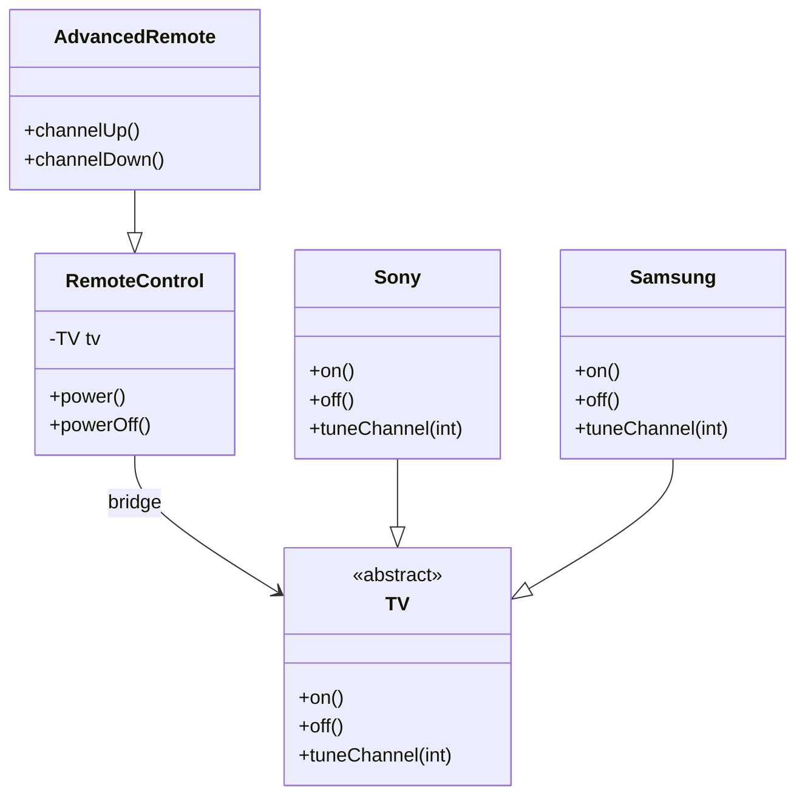
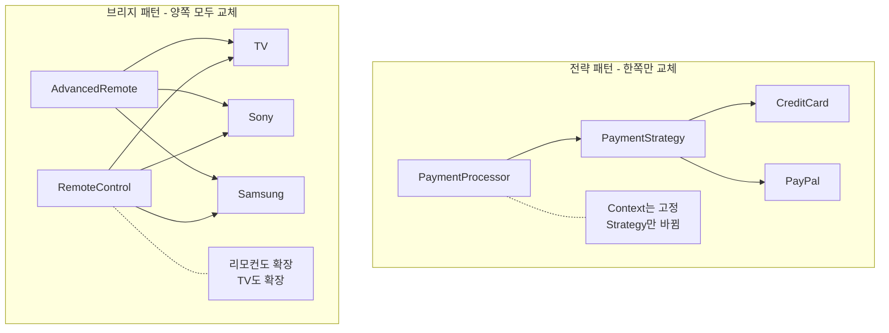
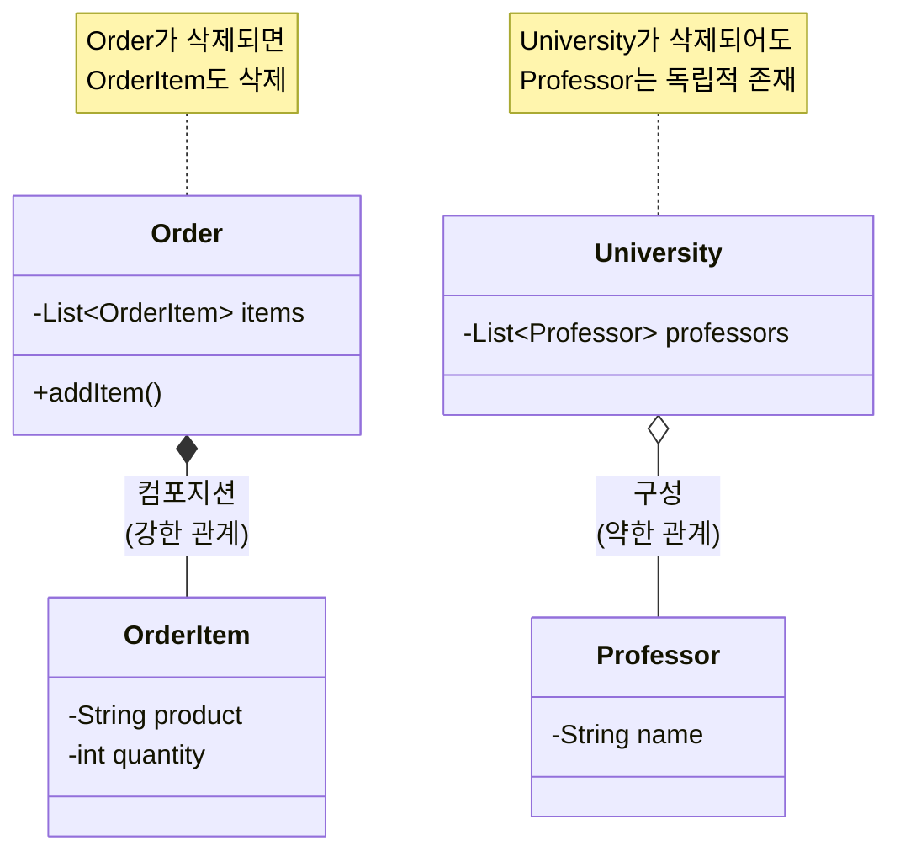
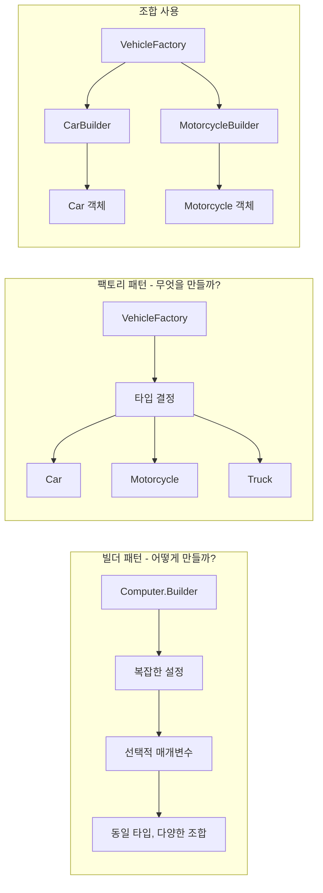
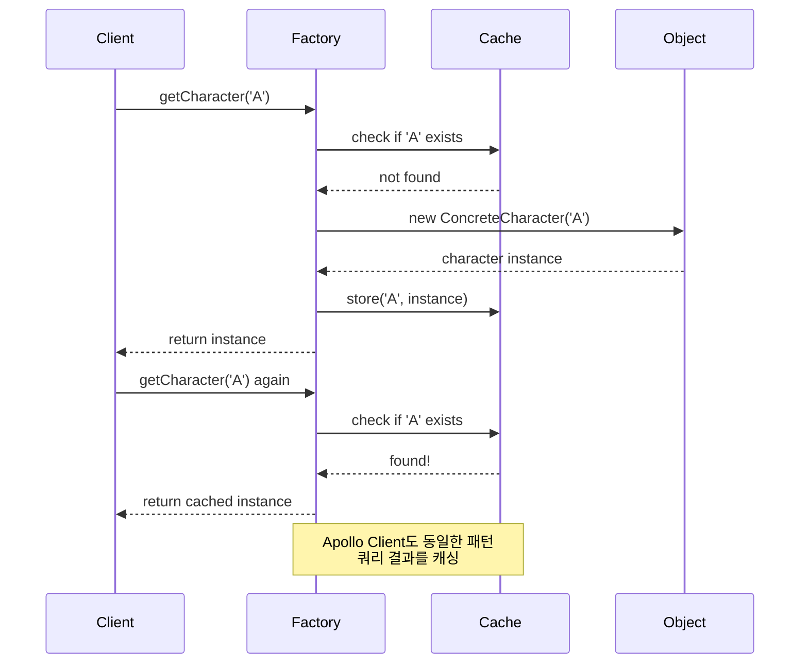
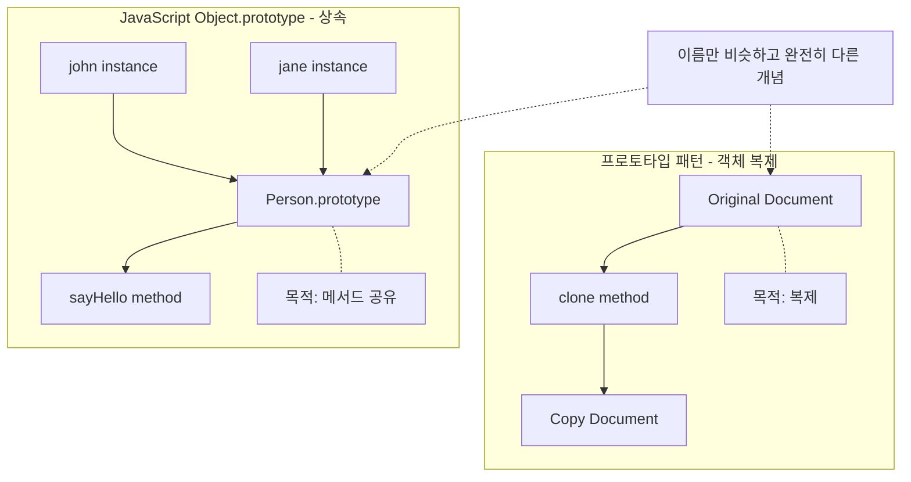

# 디자인 패턴 & 객체 관계 정리

#### ToC

- [디자인 패턴 \& 객체 관계 정리](#디자인-패턴--객체-관계-정리) - [Toc](#toc)
  - [1. 브리지 패턴의 TV-리모컨 관계](#1-브리지-패턴의-tv-리모컨-관계)
  - [2. 브리지 패턴 = 전략 패턴의 진화 버전 ✅](#2-브리지-패턴--전략-패턴의-진화-버전-)
  - [3. 컴포지션 vs 구성(Aggregation)](#3-컴포지션-vs-구성aggregation)
  - [4. 빌더 패턴의 자유로운 객체 생성](#4-빌더-패턴의-자유로운-객체-생성)
  - [5. 빌더 vs 팩토리 패턴 선택 기준](#5-빌더-vs-팩토리-패턴-선택-기준)
  - [6. JPA에서 FK 없는 JOIN](#6-jpa에서-fk-없는-join)
  - [7. 플라이웨이트 패턴 = 객체 캐싱](#7-플라이웨이트-패턴--객체-캐싱)
  - [8. 프로토타입 패턴 vs JavaScript Object.prototype](#8-프로토타입-패턴-vs-javascript-objectprototype)
  - [핵심 요약](#핵심-요약)

## 1. 브리지 패턴의 TV-리모컨 관계

- **TV**: 구현체(Implementor) - 다양한 브랜드별 구현
- **리모컨**: 추상화(Abstraction) - TV 참조로 위임
- **핵심**: 구현과 추상화를 분리해 독립적 확장 가능



```java
// 구현체 인터페이스
abstract class TV {
    public abstract void on();
    public abstract void off();
    public abstract void tuneChannel(int channel);
}

// 구체적인 구현체들
class Sony extends TV {
    public void on() { System.out.println("Sony TV 켜짐"); }
    public void off() { System.out.println("Sony TV 꺼짐"); }
    public void tuneChannel(int ch) { System.out.println("Sony TV " + ch + "번 채널"); }
}

class Samsung extends TV {
    public void on() { System.out.println("Samsung TV 켜짐"); }
    public void off() { System.out.println("Samsung TV 꺼짐"); }
    public void tuneChannel(int ch) { System.out.println("Samsung TV " + ch + "번 채널"); }
}

// 추상화 (리모컨)
class RemoteControl {
    protected TV tv;  // 브리지 역할

    public RemoteControl(TV tv) {
        this.tv = tv;
    }

    public void power() { tv.on(); }
    public void powerOff() { tv.off(); }
}

// 확장된 추상화
class AdvancedRemote extends RemoteControl {
    public AdvancedRemote(TV tv) { super(tv); }

    public void channelUp() { tv.tuneChannel(1); }
    public void channelDown() { tv.tuneChannel(-1); }
}
```

## 2. 브리지 패턴 = 전략 패턴의 진화 버전 ✅

- **전략 패턴**: 한쪽(알고리즘)만 교체 가능
- **브리지 패턴**: 양쪽 모두 독립적으로 확장 가능



```java
// 전략 패턴 - 한쪽만 교체
class PaymentProcessor {
    private PaymentStrategy strategy;  // 이것만 바뀜

    public PaymentProcessor(PaymentStrategy strategy) {
        this.strategy = strategy;
    }

    public void processPayment(double amount) {
        strategy.pay(amount);  // 위임
    }
}

interface PaymentStrategy {
    void pay(double amount);
}

// 브리지 패턴 - 양쪽 모두 교체
// 리모컨 종류도 확장, TV 종류도 확장
public class BridgeVsStrategyExample {
    public static void main(String[] args) {
        // 양방향 조합 가능!
        RemoteControl[] remotes = {
            new RemoteControl(new Sony()),      // 기본리모컨 + 소니TV
            new RemoteControl(new Samsung()),   // 기본리모컨 + 삼성TV
            new AdvancedRemote(new Sony()),     // 고급리모컨 + 소니TV
            new AdvancedRemote(new Samsung())   // 고급리모컨 + 삼성TV
        };
    }
}
```

## 3. 컴포지션 vs 구성(Aggregation)

- **컴포지션**: 강한 관계, 생명주기 같음, "부분이 전체 없이는 의미 없음"
- **구성**: 약한 관계, 독립적 생명주기, "협력 관계"### 컴포지션 실제 사용 시나리오



```java
// 게임 캐릭터 - 전형적인 컴포지션
class Character {
    private Inventory inventory;  // 캐릭터 없으면 무의미
    private Equipment equipment;  // 캐릭터 없으면 무의미

    public Character() {
        this.inventory = new Inventory();  // Character가 생성
        this.equipment = new Equipment();
    }
}

// 판단 기준: 부모 없이 자식이 존재할 이유가 있는가?
```

## 4. 빌더 패턴의 자유로운 객체 생성

- 지정된 생성자 변수를 **선택적으로** 설정 가능
- 메서드 체이닝으로 **순서 무관**하게 구성

```java
class Computer {
    private String cpu, ram, storage;
    private boolean bluetooth, wifi;

    public static class Builder {
        private String cpu, ram;  // 필수
        private String storage = "256GB";  // 선택적
        private boolean bluetooth = false, wifi = false;

        public Builder(String cpu, String ram) { /* 필수값 */ }
        public Builder storage(String s) { storage = s; return this; }
        public Builder wifi(boolean w) { wifi = w; return this; }
        public Computer build() { return new Computer(this); }
    }
}

// 자유로운 조합
Computer gaming = new Computer.Builder("i9", "32GB")
    .storage("1TB").wifi(true).build();
```

## 5. 빌더 vs 팩토리 패턴 선택 기준

- **빌더**: "어떻게 만들까?" - 복잡한 설정
- **팩토리**: "무엇을 만들까?" - 타입 선택



```java
// 팩토리 - 타입 결정
abstract class Vehicle { public abstract void start(); }
class VehicleFactory {
    public static Vehicle create(String type) {
        switch(type) {
            case "car": return new Car();
            case "motorcycle": return new Motorcycle();
        }
    }
}

// 조합: 팩토리 → 빌더 → 객체
Vehicle car = VehicleFactory.createBuilder("car")
    .engine("V6").color("Red").build();
```

## 6. JPA에서 FK 없는 JOIN

- FK가 없어도 **공통된 값을 가진 컬럼**이 있으면 JOIN 가능

```java
@Entity
class User {
    @Id private Long id;
    private String departmentCode;  // FK 아님

    @OneToOne
    @JoinColumn(name = "department_code", referencedColumnName = "code")
    private Department department;
}

@Entity
class Department {
    @Id private Long id;
    private String code;  // User.departmentCode와 매칭
}

// JPQL 직접 JOIN
@Query("SELECT u, d FROM User u JOIN Department d ON u.departmentCode = d.code")
List<Object[]> findUsersWithDepartments();
```

## 7. 플라이웨이트 패턴 = 객체 캐싱

- Apollo Client 쿼리 캐싱과 **동일한 메커니즘**
- "한 번 만든 것을 재사용" 철학



```java
class CharacterFactory {
    private static Map<Character, CharacterFlyweight> cache = new HashMap<>();
        public static CharacterFlyweight getCharacter(char c) {
            return cache.computeIfAbsent(c, ConcreteCharacter::new);
        }
}

// "HELLO WORLD" → H,E,L,O,W,R,D = 7개 객체만 생성 (L 재사용)
```

## 8. 프로토타입 패턴 vs JavaScript Object.prototype

- **프로토타입 패턴**: 객체 **복제** (깊은/얕은 복사)
- **JS Object.prototype**: 객체간 **상속/메서드 공유**



```java
 // Java 프로토타입 패턴 - 복제
class Document implements Cloneable {
    private String title;
    private List<String> pages;

    public Document clone() {
        Document cloned = (Document) super.clone();
        cloned.pages = new ArrayList<>(this.pages);  // 깊은 복사
        return cloned;
    }
}

Document copy = original.clone();  // 복제본 생성
```

```javascript
// JavaScript Object.prototype - 상속
Person.prototype.sayHello = function () {
  return `Hello, ${this.name}`;
};

const john = new Person("John");
john.sayHello(); // 프로토타입 체인에서 메서드 찾기

// JS에서 진짜 프로토타입 패턴
const copy = original.clone(); // 객체 복제
```

## 핵심 요약

| 패턴/개념        | 핵심 포인트                  | 언제 사용?                     |
| ---------------- | ---------------------------- | ------------------------------ |
| **브리지**       | 양방향 확장 가능한 전략 패턴 | 추상화와 구현 모두 독립적 확장 |
| **컴포지션**     | 강한 소유, 생명주기 공유     | 부분이 전체 없이 의미 없을 때  |
| **구성**         | 협력 관계, 독립적 생명주기   | 서로 도움주는 관계             |
| **빌더**         | 복잡한 객체의 선택적 구성    | 매개변수 많고 선택적일 때      |
| **팩토리**       | 타입 결정과 생성 분리        | 런타임 타입 결정               |
| **플라이웨이트** | 객체 레벨 캐싱               | 동일 객체 많이 필요할 때       |
