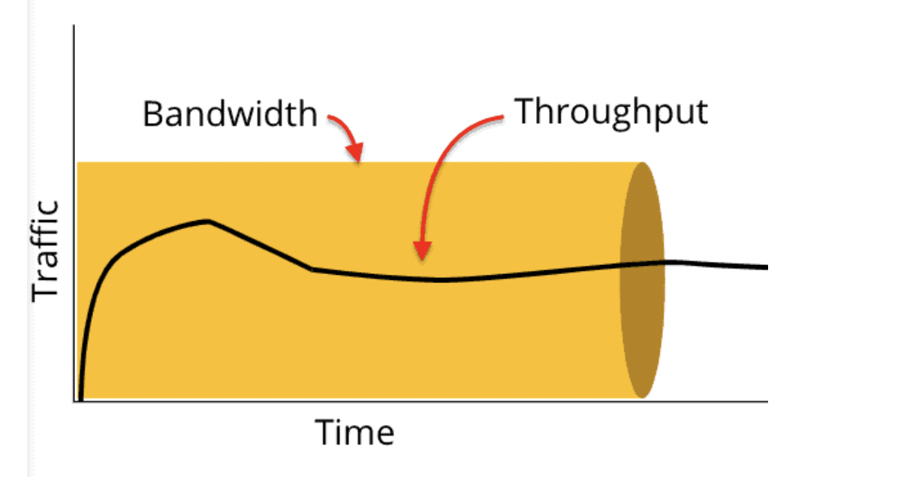
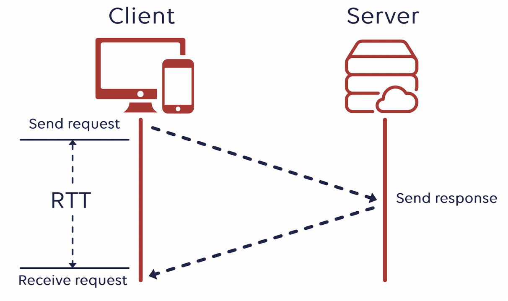
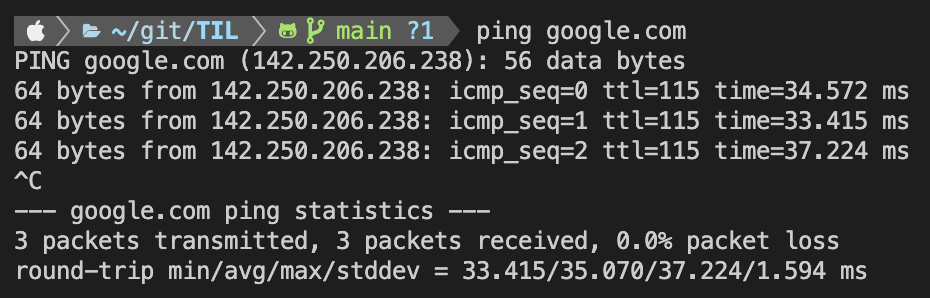

# 네트워크, 처리량, 트래픽, 대역폭, RTT

## 네트워크

> - 네트워크란 `노드(node)`와 `링크(link)`가 서로 `연결`되어 있으며 `리소스를 공유하는 집합`을 의미
>   > - 노드 : 서버, 라우터, 스위치 등 네트워크 장치
>   > - 링크(엣지) : 유선 또는 무선과 같은 연결매체 (와이파이나 LAN)

## 트래픽

> 트래픽은 특정시점에 링크 내의 `흐르는 데이터의 양`
>
> > 예를 들어 서버에 저장된 파일(문서,이미지,동영상 등)을 클라이언트(사용자)가 다운로드 시 발생되는 데이터의 `누적량`을 의미
> > 

- 트래픽이 많아졌다. = 흐르는 데이터가 많아졌다.
- 처리량이 많아졌다. = 처리되는 트래픽이 많아졌다.
- 단위 : `bps(bits per second)`

### 트래픽 측정 단위:

- bps (bits per second) - 초당 전송되는 비트 수
- Kbps (kilobits per second) - 1,000 bps
- Mbps (megabits per second) - 1,000,000 bps
- Gbps (gigabits per second) - 1,000,000,000 bps

#### 💡 왜 byte가 아닌 bit를 사용하는가:

- 노드[`네트워크 장비(라우터, 스위치 등)`]는 bit 단위로 데이터를 처리
- `통신 프로토콜`과 `네트워크 표준`이 bit 기반으로 설계됨
- ISP들도 인터넷 속도를 bps로 표시 (예: 100Mbps 인터넷)

다만 파일 크기나 저장 용량은 byte 단위를 사용한다. 그래서 100Mbps 인터넷으로 파일을 다운로드할 때 실제 속도는 약 12.5MB/s (100÷8) 정도가 된다.

#### 💡ISP

- ISP는 `Internet Service Provider`의 줄임말로, 인터넷 서비스 제공업체를 의미

> ISP가 하는 일:
>
> > - 개인이나 기업에게 인터넷 연결 서비스를 제공
> > - `인터넷 회선`을 통해 웹사이트, 이메일, 온라인 서비스에 접속할 수 있게 해줌
> > - 네트워크 인프라(케이블, 라우터, 서버 등)를 구축하고 관리
> > - e.g.) KT (Korea Telecom), SK브로드밴드, LG유플러스

ISP가 제공하는 인터넷 요금제를 보면 `100Mbps`, `500Mbps`, `1Gbps` 같은 속도로 표시되는데, 이것이 바로 앞서 말한 bps 단위

## 처리량

> `처리량(throughput)`은 `링크` 내에서 성공적으로 전달된 데이터의 양을 말하며 보통 얼만큼의 `트래픽을 처리했는지`를 나타낸다.
>
> > 많은 트래픽을 처리한다 = 많은 처리량을 가진다.

- 단위 : `bps(bits per second)` 초당 전송 또는 수신되는 비트 수

> 처리량은 사용자들이 많이 `접속할 때마다 커지는 트래픽,` `네트워크 장치 간의 대역폭`, 네트워크 중간에 발생하는 에러, 장치의 하드웨어 스펙에 영향을 받는다.

## 대역폭

> `대역폭(bandwidth)`은 주어진 `시간` 동안 네트워크 연결을 통해 흐를 수 있는 `최대 비트 수`를 말하며 `최대로 처리할 수 있는 트래픽`을 말한다.
>
> > 대역폭이 높을수록 사용자에게 빠른 서비스를 제공 할 수 있고. 대략적인 `최대동시접속자수를 유추하는데의 척도`가 된다.

- 단위 : `bps(bits per second)` 초당 전송 또는 수신되는 비트 수

## RTT

> `RTT(Round Trip Time : 왕복 지연시간)`는 신호를 전송하고 해당 신호의 수신확인에 걸린 시간을 더한 값이자 `어떤 메시지가 두 장치 사이를 왕복하는 데 걸린 시간`을 의미
> 
>
> 
